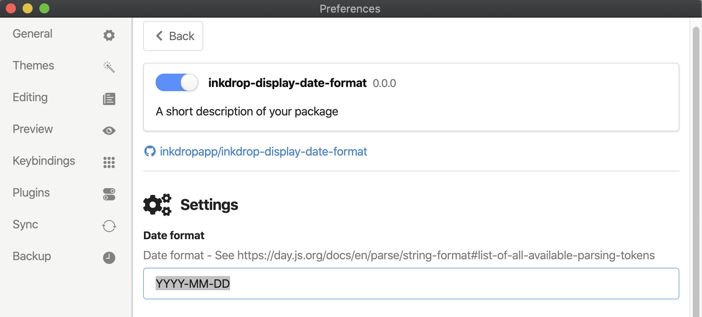

# inkdrop-display-date-format

Display Date format Tweak for [Inkdrop](https://inkdrop.app).

> Before

→

> After

## Installation

    ipm install inkdrop-display-date-format

## Setting

You can change date format on Setting Panel.

- Default: `YYYY-MM-DD`
- Available format: <https://day.js.org/docs/en/parse/string-format#list-of-all-available-parsing-tokens>

## Contributing

1. Fork it!
2. Create your feature branch: `git checkout -b my-new-feature`
3. Commit your changes: `git commit -am 'Add some feature'`
4. Push to the branch: `git push origin my-new-feature`
5. Submit a pull request :D

## License

MIT